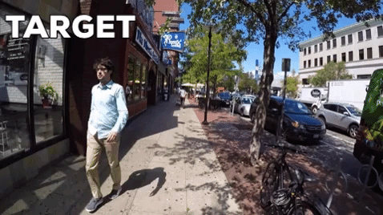

# Minimal memory for Details in Real Life Events
This repository, to the best of its ability, aims to walk the user to walk through the data and computational analysis for the paper [Minimal memory for details in real life events](https://www.nature.com/articles/s41598-018-33792-2).

### General Approaches
The study was divided into two memory encoding parts called EXPI (conducted outdoors around MIT campus) and EXPII (conducted indoors inside the Museum of Fine Arts, Boston or the MFA). For details regarding methods, please go through the [paper](https://www.nature.com/articles/s41598-018-33792-2).

The code and analysis for EXPI is included in the folder [~/EXPI](https://github.com/misrapranav/try1/tree/master/EXPI) and that for the other experiment is in [~/EXPII](https://github.com/misrapranav/try1/tree/master/EXPII).

### Data
1 second videos clips from the a particular subjects own encoding phase and similar looking foil clips were used. The subject had the task to distinguish whether a clip belonged to his/her own experience or not.

##### EXPI Data
[~/EXPI/annotationsMIT1](https://github.com/misrapranav/try1/tree/master/EXPI/annotationsMIT1)
These files contain the labels and annotations done for each video for EXPI.

[~/EXPI/IMAGES](https://github.com/misrapranav/try1/tree/master/EXPI/IMAGES)
These files contain snapshots of 1-second clips shown to each subject during the memory tests. Each image has corrsponding annotations in rows of files in [~/EXPI/annotationsMIT1](https://github.com/misrapranav/try1/tree/master/EXPI/annotationsMIT1)

[~/EXPI/FC7](https://github.com/misrapranav/try1/tree/master/EXPI/FC7)
These files contain Alexnet-FC7 features of snapshots of 1-second clips shown to each subject during the memory tests. Each feature vector has corrsponding annotations in rows of files in [~/EXPI/annotationsMIT1](https://github.com/misrapranav/try1/tree/master/EXPI/annotationsMIT1)

##### EXPII Data
[~/EXPII/annotationInfoMFA](https://github.com/misrapranav/try1/tree/master/EXPII/annotationInfoMFA)
These files contain the labels and annotations done for each video for EXPII.

[~/EXPII/IMAGES](https://github.com/misrapranav/try1/tree/master/EXPII/IMAGES)
These files contain snapshots of 1-second clips shown to each subject during the memory tests. Each image has corrsponding annotations in rows of files in [~/EXPII/annotationInfoMFA](https://github.com/misrapranav/try1/tree/master/EXPII/annotationInfoMFA)

[~/EXPII/FC7](https://github.com/misrapranav/try1/tree/master/EXPII/FC7)
These files contain Alexnet-FC7 features of snapshots of 1-second clips shown to each subject during the memory tests. Each feature vector has corrsponding annotations in rows of files in [~/EXPII/FC7](https://github.com/misrapranav/try1/tree/master/EXPII/annotationInfoMFA)

[~/EXPII/EXTRAPOLATE](https://github.com/misrapranav/try1/tree/master/EXPII/EXTRAPOLATE)
These files contain the eye movement information in corresponding target clips.

### Figures & Analysis from Paper
##### EXPI 
[~/EXPI/EXPI.m](https://github.com/misrapranav/try1/tree/master/EXPI/EXPI.m)
Run this file and follow throught the code of this file to generate the main figures in the paper.

##### EXPII
[~/EXPII/EXPII.m](https://github.com/misrapranav/try1/tree/master/EXPII/EXPII.m)
Run this file and follow throught the code of this file to generate the main figures in the paper.

### Extra Notes
⋅⋅1. Unzip the files in [~/EXPI/TRAINED MODELS FEATURES/MIT.zip](~/EXPI/TRAINED%20MODELS%20FEATURES/MIT.zip)

⋅⋅1. Unzip the files in [~/EXPII/TRAINED_MODELS MFA_NEW/TRAINED_MODELS_UNZIP_TO_RUN_CODE.zip](~/EXPII/TRAINED_MODELS_MFA_NEW/TRAINED_MODELS_UNZIP_TO_RUN_CODE.zip) and paste the contents [~/EXPII/TRAINED_MODELS_MFA_NEW/](~/EXPII/TRAINED_MODELS_MFA_NEW/)

⋅⋅1. Figure 5 is the average of the bars in Figure S6. The individual performaces/bars for each subject can be plotted using files ~EXPII/TRAINED_MODELS_MFA_NEW/pred_XX.m

